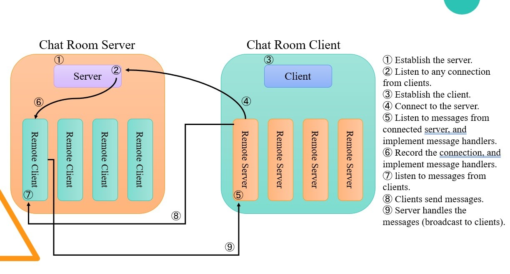

# ChatRoom
There are two major parts in the whole project: One is client of the chat room and the other is server of it. We can build the server process firstly, and then open a lot of client processes to connect to the server. By these, clients are able to communicate to others throught the server's connection.

